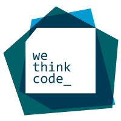

# wethinkcode_ Johannesburg

# -42_A_hitchhikers_guide_to_C
A crash course  PDF for C &amp; Algorithms, written  by myself during the WTC bootcamp in Johannesburg South Africa.
All notes/changes &amp; improvements welcome lmncube@student.wethinkcode.co.za :) 

# Topics Covered (For Bootcamp)
-Compilation
-Variables (Integers, Characters)
-Arrays (Pointers)
-Makefiles & Make
-Libraries & headers

# Advanced Topics (For Examshell, First Semester)
-Number systems & conversions
-Bit Manipulation
-Memory (Allocation, Leaks)
-Abstract Data Types (Linked Lists, Stacks)
-Big O (Space-Time Complexity, Search, recursion)
